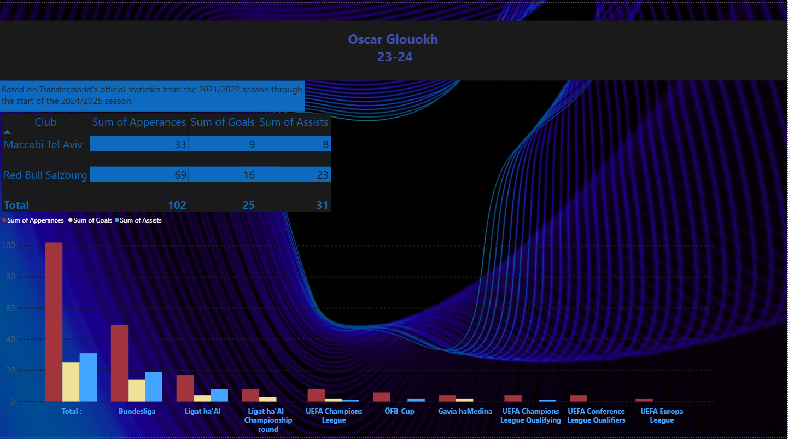

# Oscar-Gloukh-stats-summary---Power-BI
This Power BI dashboard presents Oscar Gloukh's apperances, goals and assists from the 2021/2022 season through the start of the 2024/2025 season based on data from [Transfermarkt](https://www.transfermarkt.com/).

# 🔍 Features
- Player performance overview
- Goals, assists, and appearances per competition
- KPIs and season summaries
- Clean, interactive visuals

# 🛠 Tools & Technologies
- Power BI Desktop
- Data cleaning in Excel
- Data source: Transfermarkt

# 📥 How to Use
1. Download the `.pbix` file (Go to Oscar-Gloukh-stats-summary---Power-BI/Gloukh.pbix > 3 dots in the right corner > Download)
2. Open it in Power BI Desktop.
3. Explore and interact with the visuals.
